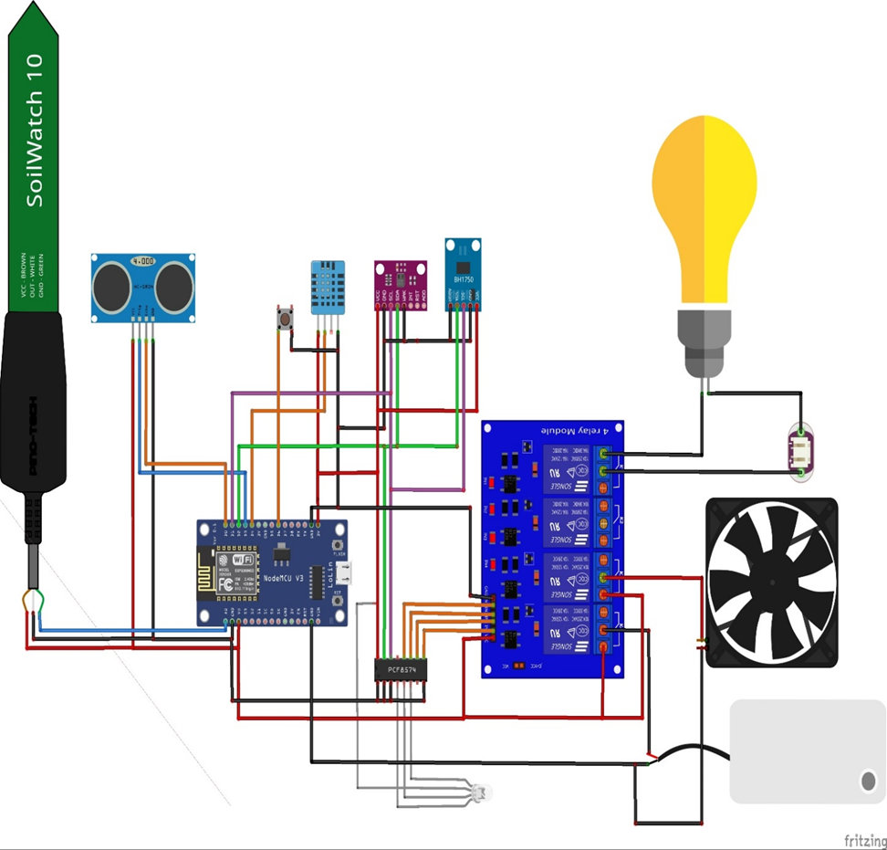

# project-growbox-esp8266
System układu sterującego GrowBox 

## Applications features:

### Sczytywanie wartości z czujników:  
- temperatury powietrza 
- wilgotności powietrza
- stężenia eCO2 w powietrzu
- związków organicznych w powietrzu
- natężenia światła 
- ilości wody w zbiorniku
- wilgotności gleby

### Sterowanie urządzeniem ###
- ręczne włączenie światła, pompy, wentylatora
- ustawienie wartości progowej wilgotności gleby do automatycznego podlewania
- ustawienie cyklu naświetlania

### komunikacja
- wysyłanie danych do FireBase
- parowanie urządzenia z siecią lokalną

## Screens: 
Schemat układu sterującego

